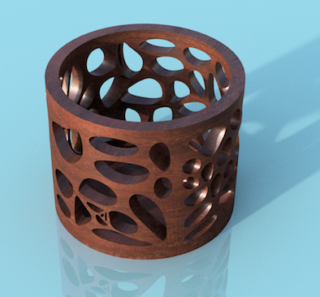

#  Fusion360Voronoi

This script is used for generating voronoi sketches in [Autodesk Fusion 360](http://fusion360.autodesk.com/).  Once created, these sketches may then be used for creating or modifying models.

## JavaScript Add-In Support in Fusion 360

Note that JavaScript development (editing/debugging) is no longer supported within Fusion 360. But existing JavaScript add-ins, such as *Voronoi* can still be installed and run.

More information here:

https://forums.autodesk.com/t5/fusion-360-api-and-scripts/image-2-surface-script-for-fusion-360/m-p/7324273#M4403

## Installation

Please follow the instructions here:

https://knowledge.autodesk.com/support/fusion-360/troubleshooting/caas/sfdcarticles/sfdcarticles/How-to-install-an-ADD-IN-and-Script-in-Fusion-360.html

Note, you can still add scripts implemented in JavaScript.

## Usage

1. Run the "Voronoi" script from the Script Manager
2. The settings dialog will be shown.  Adjust to your preferences:

  

  - Sketch Selection: Select a sketch to insert Voronoi or none to create a sketch.
  - Edge Style: Straight or Curved edges
  - Number of Cells (2-256) : Number of cells created in the sketch
  - Number of Lloyd's relax iterations: 
  - Pattern width : Width of the area filled with cells
  - Pattern height : Height of the area filled with cells
  - % to scale cells (10-100) : Percentage to scale down each of the cells
3. Click OK to generate the sketch

Note that a large number (> 128) of cells may take a while to generate (sometimes several minutes).

Once the voronoi sketch is created I will usually project the geometry onto a surface and then modify from there. Note that projecting onto a curved surface will not work at this time. In this case I'll use push/pull on the voronoi geometry to modify existing models. The image above was created using this method and a 128 cell voronoi pattern.

## Video Screencast 

Please view the following screencast to see Voronoi in use: [Using the Voronoi v2 add-in for Fusion 360](https://autode.sk/2S2jpR5)

## Examples

Examples posted on my [Fusion 360 project gallery](https://fusion360.autodesk.com/projects/voronoi-script).

## Issues

- One cell may not be filled after generation.  Adjusting a control point then forces it to fill.
- It's not possible to adjust the spline's knots and strengths therefore the curves don't conform as close as they should.  The "% Scale Cell" value is a workaround for this.  Scaling down the cells reduces the possible overlap of the cells.

## Credits

This code makes use of the Raymond Hill's well done Javascript-Voronoi code:
https://github.com/gorhill/Javascript-Voronoi

### Lloyd's Relaxation Support

Github user [LeonFedotov](https://github.com/LeonFedotov) kindly submitted the changes to support Lloyd's relaxation algorithm.  More information about the algorithm on [Wikipedia](https://en.wikipedia.org/wiki/Lloyd%27s_algorithm).
