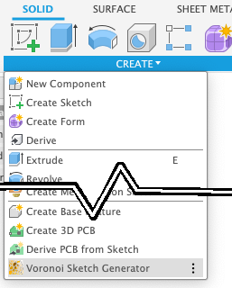
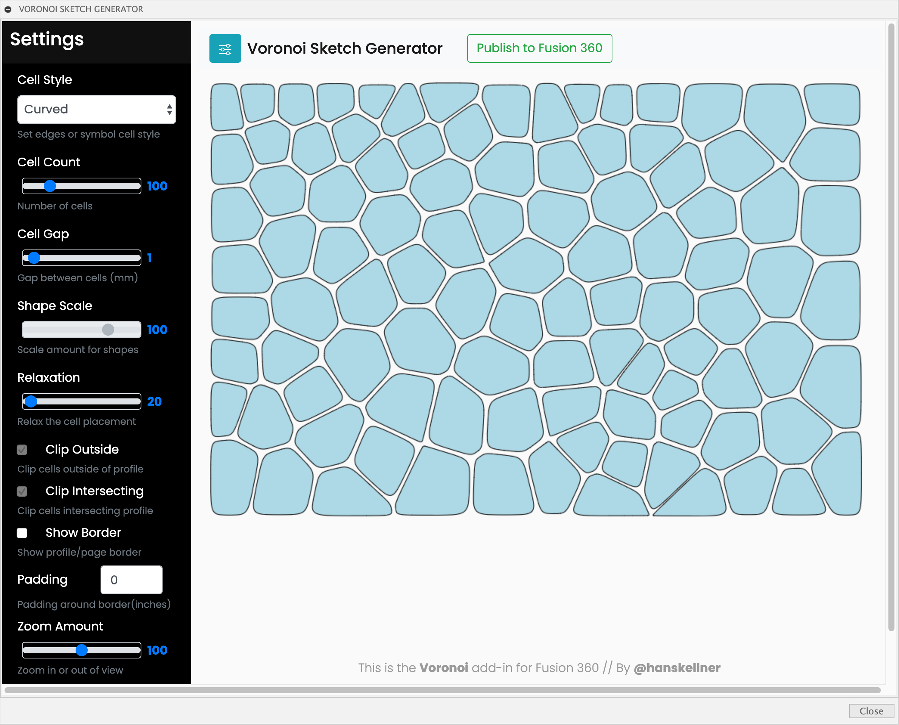

#  Voronoi Sketch Generator for Fusion 360


This is an [Autodesk Fusion 360](http://fusion360.autodesk.com/) add-in for generating voronoi diagrams.  Once created, a voronoi diagram is inserted into a sketch and then may be used for creating or modifying models.

## Installation

Installing the add-in in the Fusion 360 Addins folder allows it to automatically be found and displayed in the add-ins list.

### Mac Add-Ins Folder

```
"$HOME/Library/Application Support/Autodesk/Autodesk Fusion 360/API/AddIns/"
```

### Windows Add-Ins Folder

```
"C:\Users\%YOUR_USER_NAME%\AppData\Roaming\Autodesk\Autodesk Fusion 360\API\AddIns"
```

1. With your Finder or File Explorer window, locate the AddIns folder.
1. Create a folder within the AddIns folder with the same name as the add-in.  In this case, "Voronoi".
1. Extract all of the add-in files from the (ZIP) archive and place them in this folder.
1. Now the add-in is ready for Fusion 360.  Start Fusion 360.
1. Display the Scripts and Add-Ins dialog.  The "Voronoi" add-in should be listed.
1. See the *Usage* section below for running and using.

> As an alternative to the above installation location, you can just place the files in their own folder within a location of your choice.  For example, in your Documents or Home folder.  Doing this means the add-in will not automatically appear in the add-ins list.  You will need to manually add it using the "+" button at the top of the list.

There is additional installation help on the Fusion 260 site:

https://knowledge.autodesk.com/support/fusion-360/troubleshooting/caas/sfdcarticles/sfdcarticles/How-to-install-an-ADD-IN-and-Script-in-Fusion-360.html

## Usage

1. Run the "Voronoi" add-in from the Scripts and Add-Ins dialog.  Optionally, checkmark "Run at Startup" to automatically start each session.

    

2. The command will be added to the Create dropdown in the Solids environment.

    

3. Click on the "Create Voronoi" menuitem or button.

    

4. The add-in dialog will be displayed with the following options:

    

  - Sketch or Profile:
    You may choose one of the following:
    * Sketch: Select an existing sketch to add the voronoi diagram.
    * Sketch Profile: Select a sketch profile to define the clipping bounds and where to add the voronoi diagram.
    * Nothing: If no sketch or profile is selected then a new sketch will be created on the construction plane selected (see below).
  - Construction Plane:
    * Enabled when no sketch or profile is selected.  Select which construction plane for the new sketch created for the voronoi diagram.
  - Width, Height: The width and height of the voronoi diagram.

5. Leave the settings with their defaults and then click the 'Voronoi Editor' button.
6. The add-in palette will be displayed:

    

    * On the top title bar are:
        - Left button toggles the settings palette opened or closed.
        - Publish button will add the diagram into the selected sketch or create a new sketch.
        - Close will exit the palette without inserting the diagram.
    * On the left side of the palette are the settings that control the voronoi generation.  See below for details.
        - **Cell Style**
            This dropdown is used to define how the cells are rendered.  The first two, Curves and Straight, create the two most common style of voronoi patterns.  The remaining options are symbols.  Selecting a symbol will cause one to be inserted at the centroid of each cell and scaled to fit within the cell.  Note that the scaling is not perfect at the moment.  The rotation of each symbol is also set to a random value.
            ***Warning: Modifies the current voronoi pattern***
        - **Cell Count**
            This sets the number of cells.  Note that a large number (> 100) of cells may take a while to generate (sometimes several minutes).
            ***Warning: Modifies the current voronoi pattern***
        - **Cell Scale**
            This scales the cells and is useful to add a margin between cells or prevent overlap for symbols.
        - **Clip Outside**
            Checking this will clip (remove) and cells outside of the profile
        - **Clip Intersecting**
            Checking this will clip (remove) and cells that intersect the profile
        - **Add Border**
            Toggle the drawing of the bounds/border as specified by the width and height values.
        - **Padding**
            Adds a boundary between the pattern and the border.
        - **Zoom Amount**
            This is used to zoom the view in/out.  It does not effect the result inserted into the sketch.  It's useful for when your palette window is too small and obscures some of the diagram.

7. Adjust the settings to find a voronoi diagram that you like then click the 'Publish' button.
    Note, for voronoi diagrams with many cells (>100), there may be a delay before the palette closes and the main window appears.
8. The voronoi diagram should now appear the document window.

Once the voronoi diagram is added to a sketch, I will usually project the geometry onto a surface and then modify from there.  Or, use the pattern to cut or extrude on a body surface.  This is even possible on curved surfaces.

### Using a Profile

When a profile is selected, the add-in dialog will display the width and height of the profile.  You may click on the 'Use Profile Size' button to copy those values into the voronoi's Width and Height fields.  When the voronoi editor is displayed, the profile will be displayed as a blue outline.  The settings will initially clip any cells that fall outside of or intersect with the profile.  You may toggle those options on or off.


It's also possible to select a profile on the planar face of a body.  Here's an example:

1. Create a new cylinder on the XY construction plane.  Make it 4in diameter and 1in tall.
2. Create a new sketch on the top surface of the cylinder then click Finish Sketch.
3. Run the Create Voronoi command.  The dialog should appear.
4. Move the cursor over the top of the cylinder.  The top face should highlight.  Click to select it.
5. The dialog should now display '1 Selected' in the Sketch of Profile field.  Also, fields should now be visible showing the width and height of the profile.
    - Optionally, you can click the 'Use Profile Size' button to copy the profile dimension over to the voronoi dimensions.
    - Click 'Use Profile Size'
6. Click 'Voronoi Editor'

At this point the palette will be appear and the circular profile contaning a voronoi diagram.


7. Once satisified with the voronoi, click 'Publish'.
8. The voronoi diagram has now been inserted into the sketch created on the top of the cylinder.
    - ***NOTE*** There's an issue with the voronoi not being inserted at the correct offset.  See the 'TODO and ISSUES' section below for how to move to the correct location.
9. Now that the voronoi is over the top of the cylinder, let's cut into the cylinder.
10. Change your Selection Filters to 'Sketch Profiles'
11. Select all of the voronoi cells/curves.  The surface of the cylinder may also be selected, shift unselect just the cylinder surface and leave all the voronoi cells selected.
12. Run the Extrude command and give it an offset of '0.2 in'.  This should indicate a 'Join' operation.  Click 'Ok'.

    

13. Feel free to 'Undo' the extrude and try again but this time use an offset of '-0.2 in' to cut the pattern into the cylinder.

    

## Video Screencast 

Please view the following screencast to see Voronoi in use:

https://knowledge.autodesk.com/community/screencast/f3736c33-f135-481e-8d82-4a6fa9a56cd6

Here's a video for previous version of the add-in:

https://autode.sk/2S2jpR5

## Examples

<span align='center'></span>
<span align='center'></span>
<span align='center'></span>
<span align='center'></span>
<span align='center'></span>

Other examples posted on my [Fusion 360 project gallery](https://fusion360.autodesk.com/projects/voronoi-script).

## TODO and Issues

- Inserting a voronoi diagram with many cells may cause Fusion 360 to hang for a long time.  There may be no workaround on the add-in side.
- Re-enable Llloyd's Relaxation
- When using a profile, the voronoi diagram will not be inserted at the offset of the profile.  The workaround is to:
    1. Edit the sketch containing the voronoi
    2. Change the 'Select->Selection Filters' to select only Sketch Points.
    3. Window or Freeform select all of the voronoi cells.
    4. Select Move/Copy and move the points to the correct offset.  Note, moving the points will also move the cell curves.

## Credits

This software makes use of: https://github.com/d3/d3-delaunay

### Lloyd's Relaxation Support

Github user [LeonFedotov](https://github.com/LeonFedotov) kindly submitted the changes to support Lloyd's relaxation algorithm.

More information about the algorithm on [Wikipedia](https://en.wikipedia.org/wiki/Lloyd%27s_algorithm).
