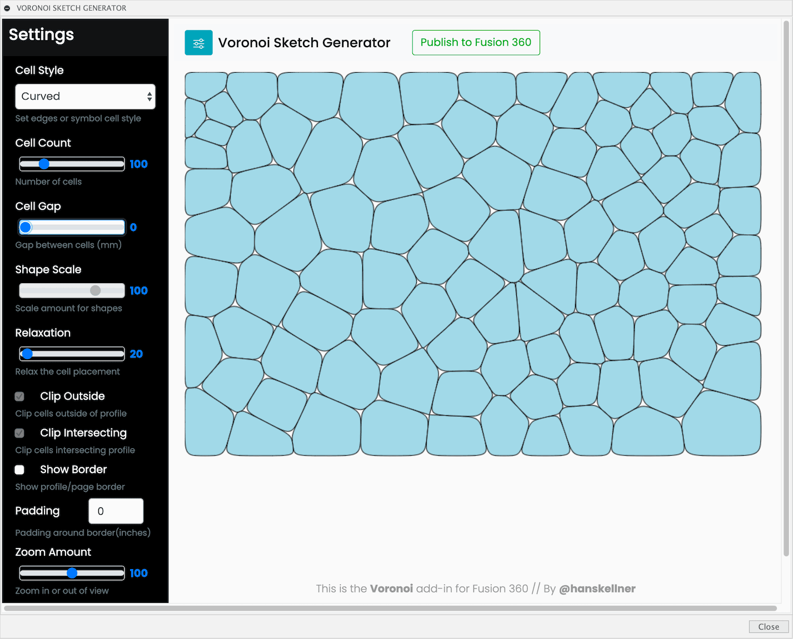
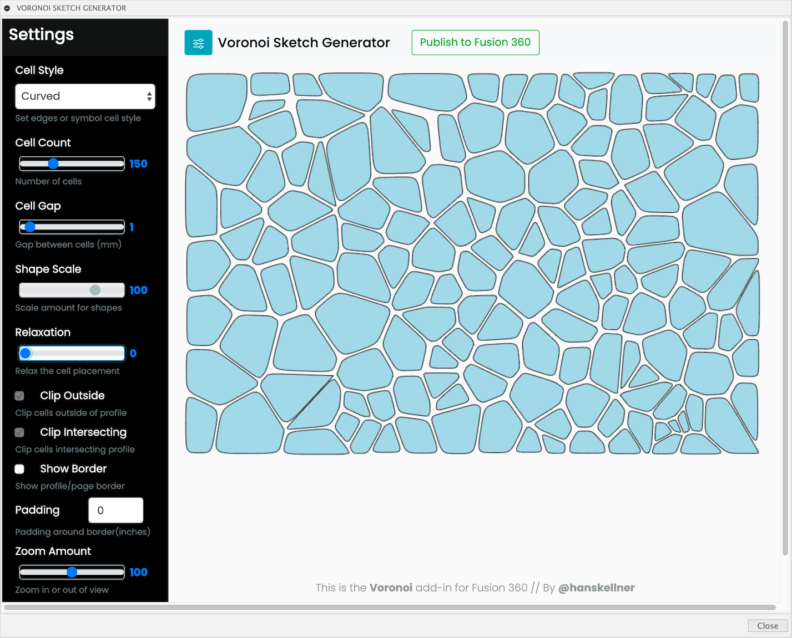

#  Voronoi Sketch Generator for Autodesk Fusion


This is an [Autodesk Fusion](http://fusion360.autodesk.com/) add-in for generating Voronoi diagrams.  Once created, a Voronoi diagram is inserted into a sketch and then may be used for creating or modifying models.


It's possible to select an existing sketch, a sketch profile, or one of the (XY, XZ, YZ) construction planes as the target of the generated diagram.  When a sketch profile is selected, it will be used to define the bounds and to clip the generated diagram.

Several styles of Voronoi diagrams may be created.  Each cell in a diagram has an outer edge.  The "edge style" may be specified as "Curves" or "Straight".  Selecting one of these styles will create a familiar style of Voronoi diagram.

The other styles place symbols at each cell location.  For example, selecting the "Triangle" style will place a triangle at each cell location.  Note that this is still an experimental feature and being refined.

See the "Usage" section for more information and help.

## Live Version

Play with a web version and download the Voronoi patterns as SVG:

https://hanskellner.github.io/Fusion360Voronoi/Voronoi.html

## Installation

Please see the most recent install instructions here:

https://knowledge.autodesk.com/support/fusion-360/troubleshooting/caas/sfdcarticles/sfdcarticles/How-to-install-an-ADD-IN-and-Script-in-Fusion-360.html 

If you are installing manually, then please download the archive file (ZIP) from Github by clicking on the "Clone or download" button and then selecting "Download ZIP".

Once you have the ZIP file, please follow the manual install instructions in the link above.

Note, installing the add-in into the Fusion 360 Addins folder allows it to automatically be found and displayed in the add-ins list.

### Mac Add-Ins Folder

```
"$HOME/Library/Application Support/Autodesk/Autodesk Fusion 360/API/AddIns/"
```

### Windows Add-Ins Folder

```
"C:\Users\%YOUR_USER_NAME%\AppData\Roaming\Autodesk\Autodesk Fusion 360\API\AddIns"
```

1. With your Finder or File Explorer window, locate the AddIns folder.
1. Create a folder within the AddIns folder with the same name as the add-in.  In this case, "Voronoi".
1. Extract all of the add-in files from the (ZIP) archive and place them in this folder.
1. Now the add-in is ready for Fusion.  Start Fusion 360.
1. Display the Scripts and Add-Ins dialog.  The "Voronoi" add-in should be listed.
1. See the *Usage* section below for running and using.

> As an alternative to the above installation location, you can just place the files in their own folder within a location of your choice.  For example, in your Documents or Home folder.  Doing this means the add-in will not automatically appear in the add-ins list.  You will need to manually add it using the "+" button at the top of the list.

There is additional installation help on the Fusion site:

https://knowledge.autodesk.com/support/fusion-360/troubleshooting/caas/sfdcarticles/sfdcarticles/How-to-install-an-ADD-IN-and-Script-in-Fusion-360.html

## Usage

1. Run the "Voronoi" add-in from the Scripts and Add-Ins dialog.  Optionally, checkmark "Run at Startup" to automatically start each session.

    

2. The command will be added to the Create dropdown in the Solids environment.

    

3. Click on the "Voronoi Sketch Generator" menuitem or button.

    

4. The add-in dialog will be displayed with the following options:

    

  - Sketch or Profile:
    You may choose one of the following:
    * Sketch: Select an existing sketch to add the voronoi diagram.
    * Sketch Profile: Select a sketch profile to define the clipping bounds and where to add the voronoi diagram.
    * Nothing: If no sketch or profile is selected then a new sketch will be created on the construction plane selected (see below).
  - Construction Plane:
    * Enabled when no sketch or profile is selected.  Select which construction plane for the new sketch created for the voronoi diagram.
  - Width, Height: The width and height of the voronoi diagram.

5. Leave the settings with their defaults and then click the 'Voronoi Editor' button.
6. The add-in palette will be displayed:

    

    * On the top title bar are:
        - Left button toggles the settings palette opened or closed.
        - Publish button will add the diagram into Fusion.
        - Download SVG button can be used to download the diagram to a local drive.  (Standalone version only)
    * On the left side of the palette are the settings that control the voronoi generation.  See below for details.
        - **Cell Style**
            This dropdown is used to define how the cells are rendered.  The first two, Curves and Straight, create the two most common style of voronoi patterns.  The remaining options are shapes/symbols.  Selecting a shape will cause one to be inserted at the centroid of each cell and scaled to fit within the cell.  Note that the scaling is not perfect at the moment.  The rotation of each symbol is also set to a random value.
            __Note: Changing this will modify the current voronoi pattern__
        - **Cell Count**
            This sets the number of cells.  Note that a large number (> 100) of cells may take a while to generate (sometimes several minutes).
            __Note: Changing this will modify the current voronoi pattern__
        - **Cell Gap**
            This scales the cells so that there is a gap of the specified size between the cells. This only effects Curved and Linear cell styles.
        - **Shape Scale**
            This scales the shapes.  This only effects cell styles other than Curved and Linear.
        - **Relaxation**
            This is used to 'relax' the spacing between the cells.  It's useful for normalizing the distances between cells and especially when using symbol styles (e.g. Stars).  More information below in the 'Relaxation' section.
        - **Clip Outside**
            Checking this will clip (remove) and cells outside of the profile
        - **Clip Intersecting**
            Checking this will clip (remove) and cells that intersect the profile
        - **Add Border**
            Toggle the drawing of the bounds/border as specified by the width and height values.
        - **Padding**
            Adds a boundary between the pattern and the border.
        - **Zoom Amount**
            This is used to zoom the view in/out.  It does not effect the result inserted into the sketch.  It's useful for when your palette window is too small and obscures some of the diagram.
        - **Enable Cell Editor**
            **BETA FEATURE** This is work-in-progress.  When enabled, this provides basic cell editing support.  It also locks down the options that will dynamicall generate or modify the current design.  See more details in the "Voronoi Cell Editor" section below.

7. Adjust the settings to find a voronoi diagram that you like then click the 'Publish' button.
    Note, for voronoi diagrams with many cells (>100), there may be a delay before the palette closes and the main window appears.
8. The voronoi diagram should now appear the document window.

Once the voronoi diagram is added to a sketch, I will usually project the geometry onto a surface and then modify from there.  Or, use the pattern to cut or extrude on a body surface.  This is even possible on curved surfaces.

### Using a Profile

When a profile is selected, the add-in dialog will display the width and height of the profile.  You may click on the 'Use Profile Size' button to copy those values into the voronoi's Width and Height fields.  When the voronoi editor is displayed, the profile will be displayed as a blue outline.  The settings will initially clip any cells that fall outside of or intersect with the profile.  You may toggle those options on or off.


It's also possible to select a profile on the planar face of a body.  Here's an example:

1. Create a new cylinder on the XY construction plane.  Make it 4in diameter and 1in tall.
2. Create a new sketch on the top surface of the cylinder then click Finish Sketch.
3. Run the 'Voronoi Sketch Generator' command.  The dialog should appear.
4. Move the cursor over the top of the cylinder.  The top face should highlight.  Click to select it.
5. The dialog should now display '1 Selected' in the Sketch of Profile field.  Also, fields should now be visible showing the width and height of the profile.
    - Optionally, you can click the 'Use Profile Size' button to copy the profile dimension over to the voronoi dimensions.
    - Click 'Use Profile Size'
6. Click 'Voronoi Editor'

At this point the palette will be appear and the circular profile contaning a voronoi diagram.


7. Once satisified with the voronoi, click 'Publish'.
8. The voronoi diagram has now been inserted into the sketch created on the top of the cylinder.
    - ***NOTE*** There's an issue with the voronoi not being inserted at the correct offset.  See the 'TODO and ISSUES' section below for how to move to the correct location.
9. Now that the voronoi is over the top of the cylinder, let's cut into the cylinder.
10. Change your Selection Filters to 'Sketch Profiles'
11. Select all of the voronoi cells/curves.  The surface of the cylinder may also be selected, shift unselect just the cylinder surface and leave all the voronoi cells selected.
12. Run the Extrude command and give it an offset of '0.2 in'.  This should indicate a 'Join' operation.  Click 'Ok'.

    

13. Feel free to 'Undo' the extrude and try again but this time use an offset of '-0.2 in' to cut the pattern into the cylinder.

    

## Cell Gap

This setting scales the cells so that there is a gap of the specified size between the cells.  This only effects Curved and Linear cell styles.

Here are views of a Voronoi after changing the setting between 0 and 4.5mm.



## Relaxation

This setting for adjusting the 'Relaxation' is useful for normalizing the distances between the cells.

Here are views of a Voronoi after changing the setting to 0, 20, and 500.



This setting is also helpful for the symbol styles.  For example, here are 'Stars' at different relaxation settings:


And here's a box with a Voronoi stars pattern cut into the top surface:


More information about the algorithm on [Wikipedia](https://en.wikipedia.org/wiki/Lloyd%27s_algorithm).

## Video Tutorials 

There are a bunch of really well done tutorial videos on YouTube.

There's also the following screencast to see the Voronoi add-in in use:

https://knowledge.autodesk.com/community/screencast/f3736c33-f135-481e-8d82-4a6fa9a56cd6

Here's a video for previous version of the add-in:

https://autode.sk/2S2jpR5

## Projecting onto a Sphere

I have been asked how to project a Voronoi sketch onto a sphere.  Please take a look at this nice tutorial that I found:

  Fusion 360 - Surface Details on a Sphere: https://youtu.be/JYCtPI6A8H4

I tried it out and it does work. But there are a few issues.

One workaround is needed at the point you want to create the Voronoi sketch.  Here are the steps:

1. Run the Voronoi add-in
    1. In the dialog, select the sketch you created on the offset plane.
    1. Enter the width and height so that it matched the rectangle that bounds the sphere.
    1. Click the Voronoi Editor button
1. Create the Voronoi pattern you desire then click Publish to Fusion
1. The Voronoi will be added as a new Sketch. This is where the workaround begins as it should have been added to the selected sketch.
1. Edit the sketch containing the Voronoi. Select the sketch profiles and point. Then select Copy from the context menu.
1. Close the sketch and edit the sketch you created on the offset plane.
1. Click Paste in the context menu to paste the Voronoi sketch.
1. Now select and move it to the correct location.
1. Continue on as shown in the video

Sorry for the work-around. Will try to figure it out.

## TODO and Issues

- When creating a voronoi within a sketch profile with curves will have issues if padding is applied.  The scaled profile will not be evenly spaced around the non-padded profile.  If the profile has straight lines, it works correctly.
- Voronoi patterns with straight lines will have fixed contraints automatically added by Fusion on import. If the lines of the cells are all black, then that is what has happened. To be able to edit/move/etc the voronoi cells, you must Unlock the lines using these steps:
    1. Edit the sketch containing the voronoi
    2. Click on the Fix/UnFix constraint button from the toolbar (looks like a lock)
    3. The the Unfix tool active, drag a selection box around all of the voronoi elements
        - On release from selection the lines should all turn blue.  If any are still black, try the steps above again.
- The Padding amount works well with rectangular profiles but not with angled ones.
- Inserting a voronoi diagram with many cells may cause Fusion to hang for a long time.  There may be no workaround on the add-in side.
- When using a profile, the voronoi diagram *may* not be inserted at the offset of the profile.  The workaround is to:
    1. Edit the sketch containing the voronoi
    2. Change the 'Select->Selection Filters' to select only Sketch Points.
    3. Window or Freeform select all of the voronoi cells.
    4. Select Move/Copy and move the points to the correct offset.  Note, moving the points will also move the cell curves.
- Issue with Voronoi not be added to selected sketch.

## Examples

<span align='center'></span>
<span align='center'></span>
<span align='center'></span>
<span align='center'></span>
<span align='center'></span>

Other examples posted on my [Fusion 360 project gallery](https://fusion360.autodesk.com/projects/voronoi-script).

## Work-In-Progress Features

Warning: These may or may not work!

**Voronoi Cell Editor**

This release contains a work in progress to allow locking and editing a Voronoi diagram.  This work isn't perfect and has lots of quirks.  But, it does allow one to make various changes to the diagram before publishing to Fusion 360.  Of course you may always just publish and edit within Fusion 360.

- Enable Cell Editor Checkbox
    - Checkmark this to 'lock' the Voronoi diagram.  This will disable some of the controls that normally cause the diagram to be dynamically updated.  It will also enable the editing support.

When the edit support is enabled, you may perform the following operations:

- Cursor over the diagram to auto-select a Voronoi cell.  You will see handles appear on a seleced cell.
- Edit Cell Edge
    - Move cursor over a control point handle then drag the handle
- Add Cell Edge Control Point
    - Click on the cell edge away from other handles.  A new control point will be added.
- Delete Control Point
    - Move cursor over a control point handle then Shift+Click.
- Move Cell
    - Move cursor over the center body of the cell and then drag
- Delete Cell
    - Move cursor over the center body of the cell and then Shift-Click

__**WARNING**__

- Selection fails to work on some of the cells on the lower or right-most part of diagram.
- There is no undo.  E.g. If you delete a cell, it's gone for good.
- The shape of a cell is altered as soon as a control point is modified or added.
- You can lose all your changes if you disable the cell editor (uncheck) and then change one of the controls.
- This is work-in-progress and there's no guarantee it will work.

## Credits

This software makes use of: https://github.com/d3/d3-delaunay

Thanks for suggestions from various folks:

- [LeonFedotov](https://github.com/LeonFedotov)
    Kindly submitted the original support Lloyd's relaxation algorithm. The support has now been replaced with the version that's part of the D3 code.
- [wassfila](https://github.com/wassfila)
- Sualp O.
- Brian G.
- All others I might have missed.
