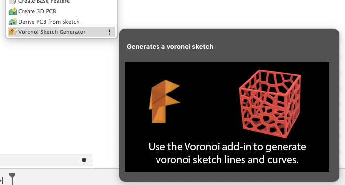

#  Voronoi Sketch Generator for Fusion 360

This is an [Autodesk Fusion 360](http://fusion360.autodesk.com/) add-in for generating voronoi diagrams.  Once created, a voronoi diagram is inserted into a sketch and then may be used for creating or modifying models.

## Installation

Please follow the instructions here:

https://knowledge.autodesk.com/support/fusion-360/troubleshooting/caas/sfdcarticles/sfdcarticles/How-to-install-an-ADD-IN-and-Script-in-Fusion-360.html

## Usage

1. Run the "Voronoi" add-in from the Scripts and Add-Ins dialog.  Optionally, checkmark "Run at Startup" to automatically start each session.

    

2. The command will be added to the Create dropdown in the Solids environment.

    

3. Click on the "Create Voronoi" menuitem or button.

    

4. A dialog will be displayed which allows you to select:

    

  - English or Metric Units 
  - Sketch Selection: A sketch to insert the voronoi.  If no sketch is selected then a new sketch will be created.
  - Construction Plane : If no sketch was selected, choose the construction plane for new sketch

    

5. Click 'Voronoi Editor'
6. The Voronoi Sketch Generator palette will be displayed.

  

7. On the left side of the palette are the settings that control the voronoi generation.  See below for details.
8. On the top title bar are:
  - Left button toggles the settings palette opened or closed.
  - Publish button will insert the diagram into the selected sketch or create a new sketch to insert into.
  - Close will exit the palette without inserting the diagram

## Settings

  - **Width, Height**
      These set the width and height that bound the result.  These values use the units specified in the initial dialog (inches or centimeters).
  - **Cell Style**
      This dropdown is used to define how the cells are rendered.  The first two, Curves and Straight, create the two most common style of voronoi patterns.  The remaining options are symbols.  Selecting a symbol will cause one to be inserted at the centroid of each cell and scaled to fit within the cell.  Note that the scaling is not perfect at the moment.  The rotation of each symbol is also set to a random value.
  - **Cell Count**
      This sets the number of cells.  Note that a large number (> 100) of cells may take a while to generate (sometimes several minutes).
  - **Cell Scale**
      This scales the cells and is useful to add a margin between cells or prevent overlap for symbols.
  - **Draw Border**
      Toggle the drawing of the bounds/border.
  - **Zoom Amount**
      This is used to zoom the view in/out.  It does not effect the result inserted into the sketch.  It's useful for when your palette window is too small and obscures some of the diagram.

Once the voronoi diagram is added to a sketch, I will usually project the geometry onto a surface and then modify from there. Note that projecting onto a curved surface will not work at this time. In this case I'll use push/pull on the voronoi geometry to modify existing models.

## Video Screencast 

Please view the following screencast to see Voronoi in use:

https://knowledge.autodesk.com/community/screencast/f3736c33-f135-481e-8d82-4a6fa9a56cd6

Here's a video for previous version of the add-in:

https://autode.sk/2S2jpR5

## Examples

Other examples posted on my [Fusion 360 project gallery](https://fusion360.autodesk.com/projects/voronoi-script).

## Issues

- The voronoi diagram is only inserted at the origin of the sketch and on the bottom side.  Working on a solution.

## TODO

- Persist user settings
- re-enable Llloyd's Relaxation
- Support more units (only inch and centimeters)

## Credits

This software makes use of: https://github.com/d3/d3-delaunay

### Lloyd's Relaxation Support

Github user [LeonFedotov](https://github.com/LeonFedotov) kindly submitted the changes to support Lloyd's relaxation algorithm.

More information about the algorithm on [Wikipedia](https://en.wikipedia.org/wiki/Lloyd%27s_algorithm).
